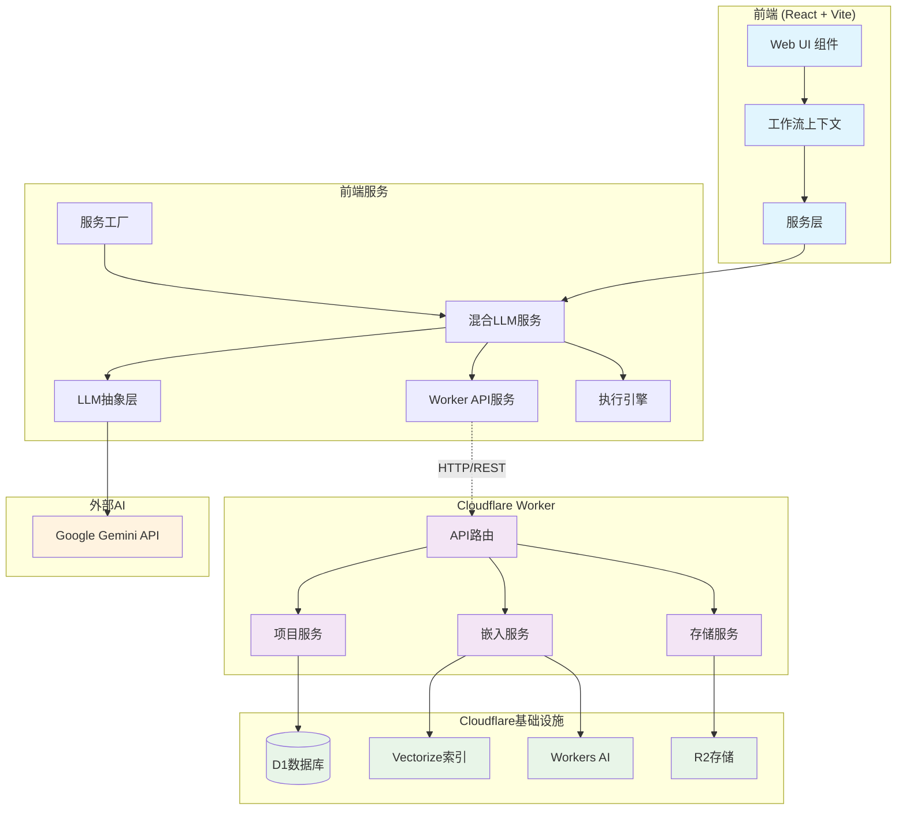
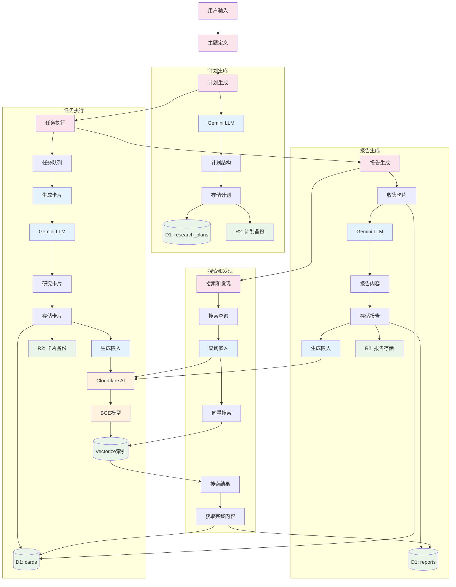
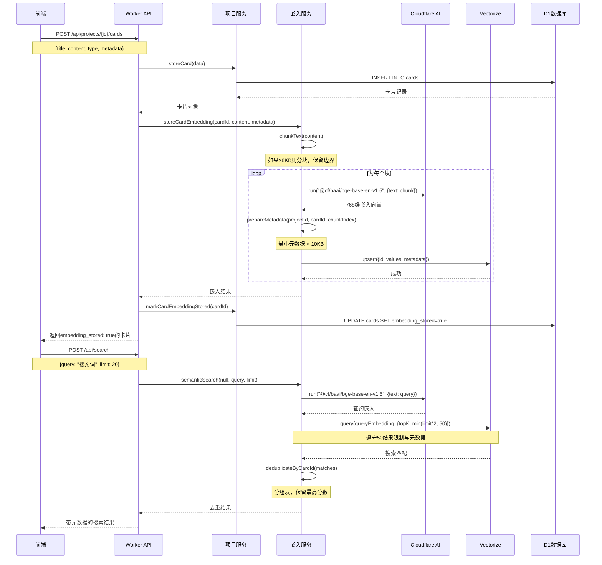
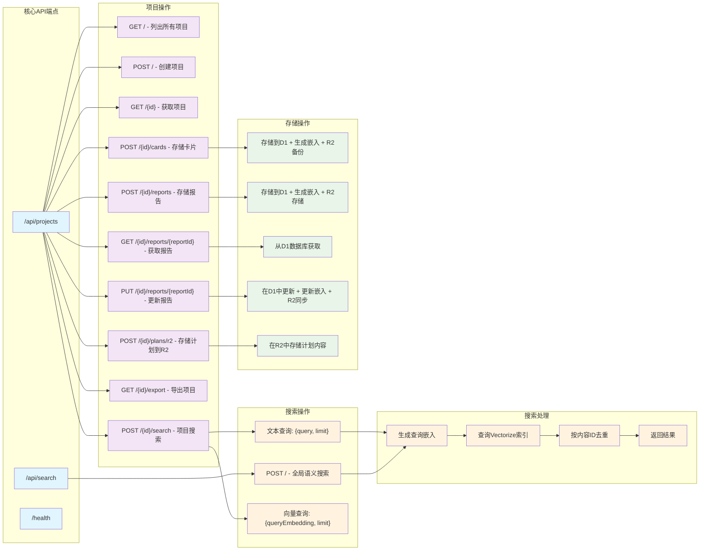
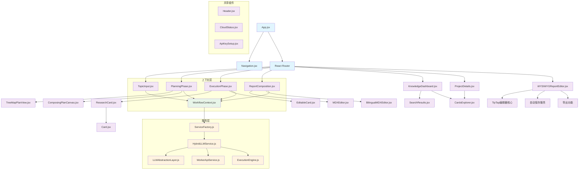
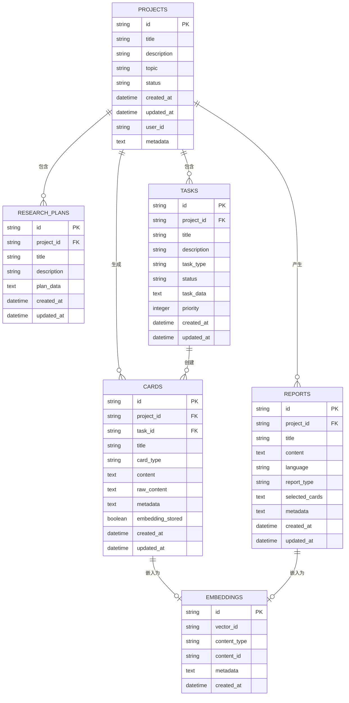

# OpenResearch 架构图表

## 1. 系统架构概览

## 2. 数据流架构

## 3. 嵌入管道架构

## 4. API端点结构

## 5. 组件层次结构

## 6. 数据库架构关系

---

*生成于: 2025-08-19*
*架构版本: v2.1 (所见即所得编辑器与知识库更新)*

## 最近更新 (v2.1)

- **所见即所得报告编辑器**: 添加基于TipTap的富文本编辑器，支持自动保存
- **知识库仪表板**: 增强的项目管理和搜索界面
- **报告编辑API**: 用于获取和更新单个报告的新端点
- **组件层次结构**: 更新以包含WYSIWYGReportEditor、KnowledgeDashboard、ProjectDetails和CardsExplorer
- **API扩展**: 为报告编辑工作流程添加GET/PUT端点

## 架构特点

### 混合架构优势
- **前端AI操作**: 所有Gemini AI交互在客户端进行，降低延迟
- **云存储管理**: Cloudflare Workers处理数据持久化和搜索
- **回退策略**: 云服务不可用时前端仍可独立工作
- **边缘计算**: 利用Cloudflare全球网络实现低延迟访问

### 数据流优化
- **语义搜索**: 使用BGE嵌入模型实现高质量向量搜索
- **内容分块**: 大内容自动分块处理，保留语义边界
- **去重逻辑**: 智能合并分块结果，提高搜索相关性
- **实时同步**: 前端与云存储的实时数据同步

### 安全与性能
- **API密钥隔离**: 前端和后端API密钥分离管理
- **嵌入安全**: 服务器端生成嵌入，避免敏感数据泄露
- **缓存策略**: 多层缓存优化响应速度
- **负载均衡**: Cloudflare网络自动负载分配