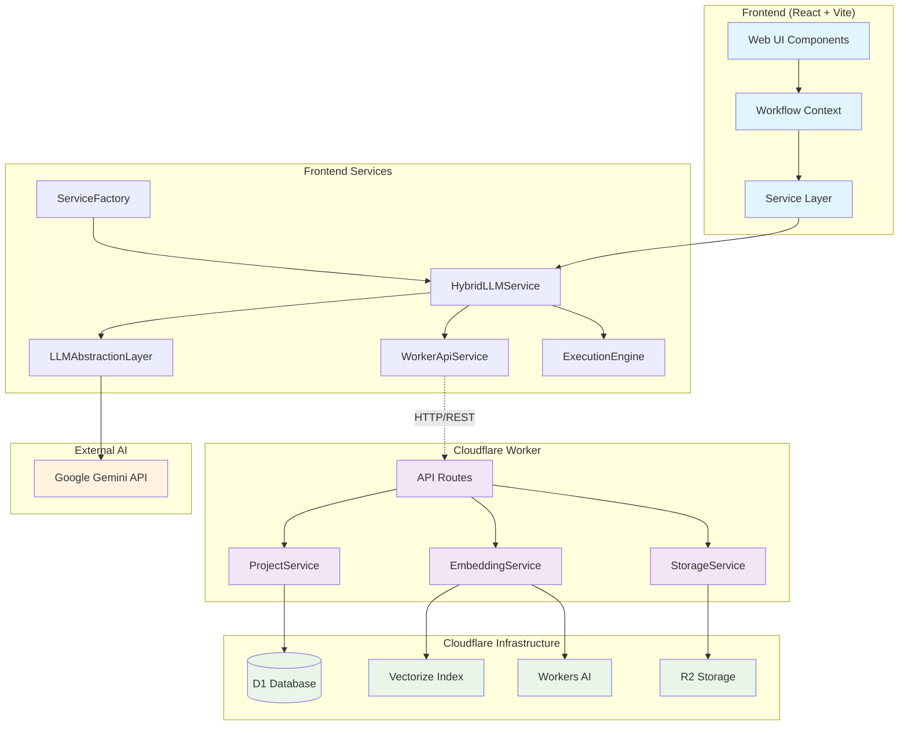
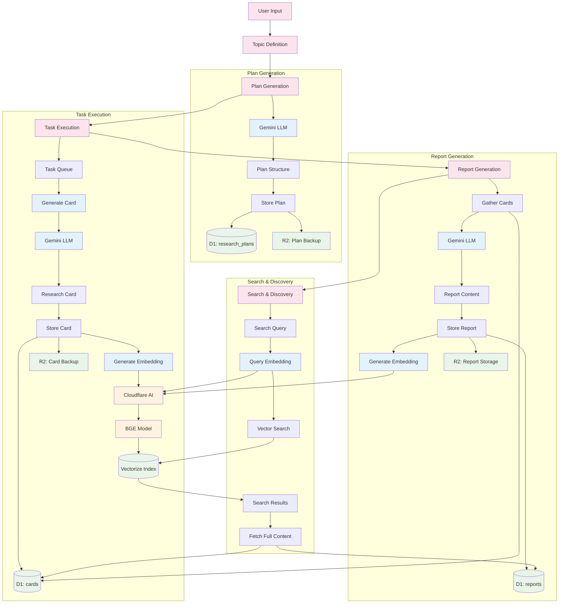
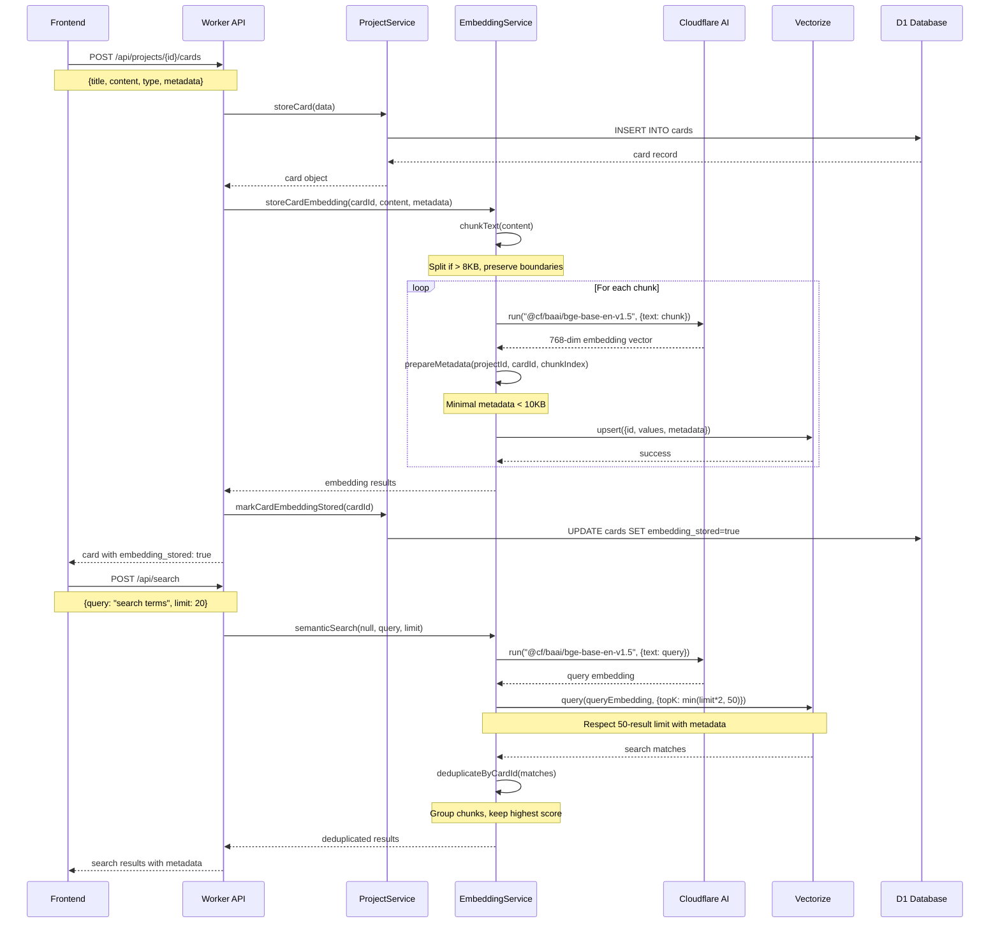
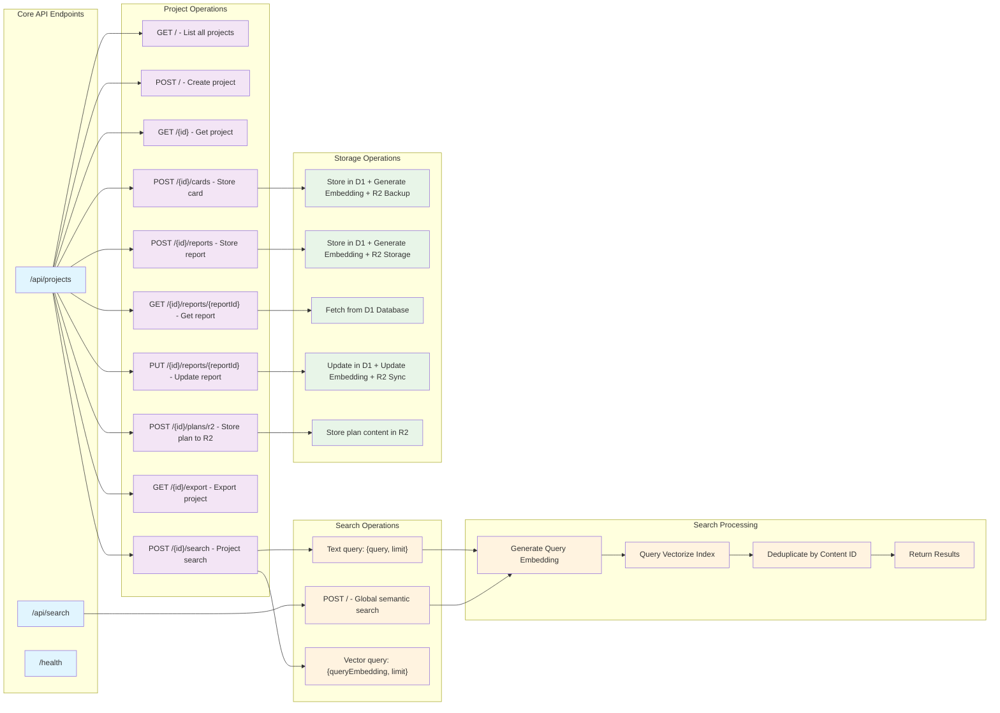
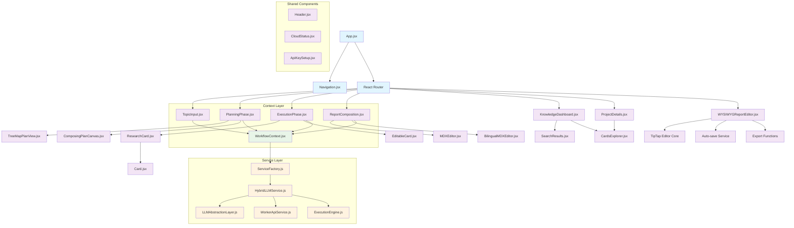
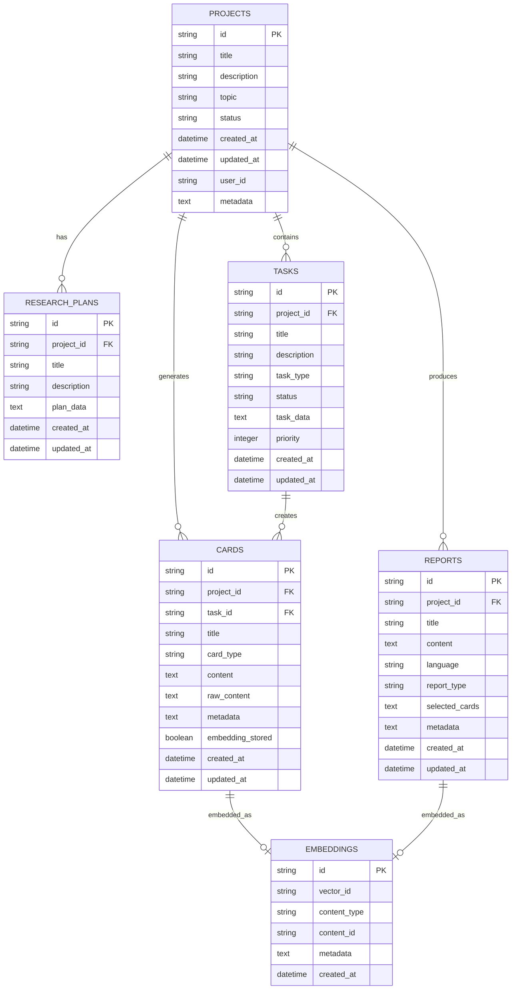

# OpenResearch Architecture Diagrams

## 1. System Architecture Overview

## 2. Data Flow Architecture

## 3. Embedding Pipeline Architecture

## 4. API Endpoint Structure

## 5. Component Hierarchy

## 6. Database Schema Relationships

---

*Generated on: 2025-08-19*
*Architecture Version: v2.1 (WYSIWYG Editor & Knowledge Base Update)*

## Recent Updates (v2.1)

- **WYSIWYG Report Editor**: Added TipTap-based rich text editor with auto-save
- **Knowledge Base Dashboard**: Enhanced project management and search interface
- **Report Editing API**: New endpoints for getting and updating individual reports
- **Component Hierarchy**: Updated to include WYSIWYGReportEditor, KnowledgeDashboard, ProjectDetails, and CardsExplorer
- **API Extensions**: Added GET/PUT endpoints for report editing workflow